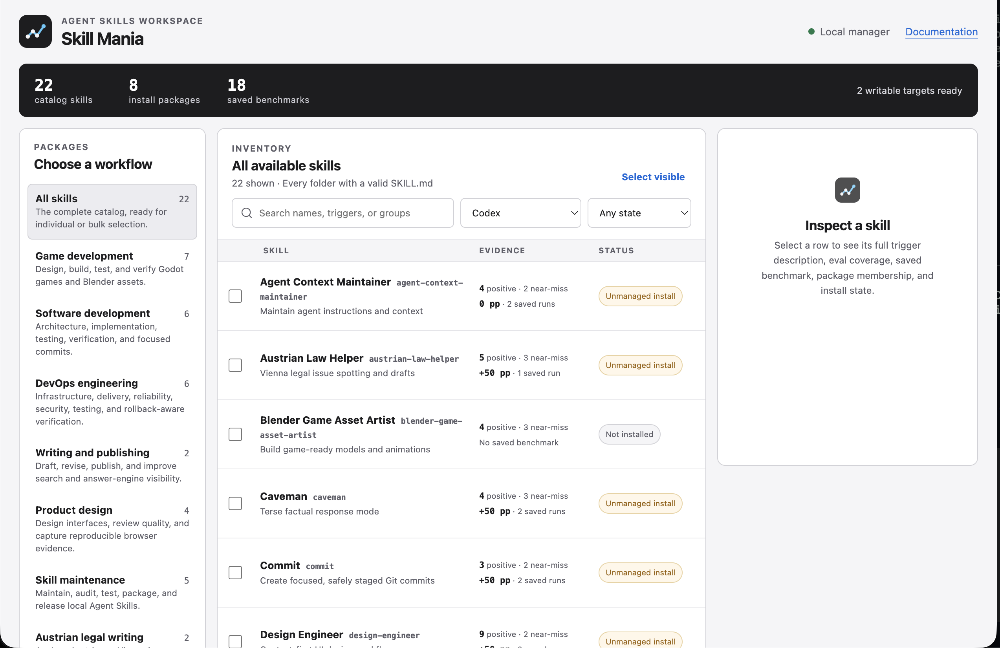

<p align="center">
  
</p>

# Skill Mania: Agent Skills Manager for Codex, Claude Code, and GitHub Copilot

Skill Mania is a portable Agent Skills library and local skill manager for Codex, Claude Code, and GitHub Copilot. Install one skill, an overlapping workflow package, or the complete catalog from the command line or the Docker-based Go interface. The tool-neutral `skills/` tree remains the canonical source for every packaged distribution.

## Start Here

- Browse `skills/<name>/SKILL.md` to understand a workflow before installing it.
- Install every portable skill as an independent snapshot with `./scripts/install-local.sh --all --copy`.
- Install a workflow package with `./scripts/install-local.sh --group game-development --copy`.
- Start the local visual manager with `docker compose up --build --detach`, then open <http://127.0.0.1:8787>.
- Install one curated MCP server at a time with `./scripts/install-mcp.py --codex <name>`.
- Before publishing a change, run `./scripts/check-release-ready.sh`; the tag-driven GitHub workflow creates the release.

## Visual Skill Manager

The local Go interface discovers the full repository catalog, groups skills by workflow, shows installation ownership for Codex and Claude Code, and presents eval coverage plus saved benchmark history before installation.

<p align="center">
  
</p>

```bash
docker compose up --build --detach
```

Open <http://127.0.0.1:8787>. The image is built locally as `skill-mania:local`; it is not published to a registry. See the [local Skill Manager guide](docs/skill-manager.md) for directory overrides, ownership rules, benchmark imports, and troubleshooting.

## Choose a Skill

| If you need to… | Start with… |
| --- | --- |
| Implement, debug, refactor, or review application behavior | `senior-developer` |
| Inspect, stage, and create a focused local Git commit | `commit` |
| Design tests, reproduce a regression, or stabilize CI | `testing-engineer` |
| Create UI, review UI, or collect browser evidence | `design-engineer`, `design-reviewer`, `visual-qa` |
| Design gameplay, levels, quests, Blender assets, or implement a Godot game | `gameplay-consultant`, `godot-level-designer`, `godot-quest-designer`, `blender-game-asset-artist`, `godot-game-creation-engineer` |
| Assess security, production operations, or system boundaries | `security-engineer`, `senior-devops-engineer`, `software-architect` |
| Improve search visibility or prose, or handle an Austrian/Vienna legal issue | `seo-geo`, `writing-assistant`, `austrian-law-helper` |
| Maintain local skill metadata or vet an external package | `agent-context-maintainer`, `skill-curator` |
| Change output length or implementation scope | `caveman`, `ponytail` |

Use the first matching domain role. Add `caveman` only when the user explicitly invokes Caveman mode; an ordinary request to be brief needs no overlay. Add `ponytail` only for a deliberately minimal implementation.

## Included Skills

### Build and test

- `commit` - explicit-path staging, staged-diff verification, and focused local commits without automatic pushes.
- `senior-developer` - scoped application implementation, debugging, refactoring, and review.
- `testing-engineer` - test strategy, regression coverage, Playwright/UI tests, and flaky-test triage.
- `implementation-verifier` - independent post-implementation verification against per-skill checklists with evidence-backed verdicts.
- `software-architect` - system boundaries, tradeoffs, contracts, and migration planning.

### Design and game work

- `design-engineer` - context-first UI design, planning, implementation, and review loops.
- `design-reviewer` - evidence-based UI/design critique and pass/fail gates.
- `visual-qa` - reproducible browser evidence for responsive UI and runtime findings.
- `gameplay-consultant` - player experience, mechanics, balance, accessibility, and playtest guidance.
- `godot-level-designer` - playable Godot level pitches, flow, grayboxing, encounters, art handoffs, and level playtests.
- `godot-quest-designer` - reactive quest graphs, emotional arcs, world facts, consequences, persistence, and narrative path testing.
- `blender-game-asset-artist` - game-ready Blender models, rigs, animations, glTF handoff, and Godot import verification.
- `godot-game-creation-engineer` - complete-game and vertical-slice planning, Godot implementation, system integration, debugging, and exports.

### Operate, secure, and discover

- `security-engineer` - threat modeling, vulnerability triage, and practical hardening.
- `senior-devops-engineer` - infrastructure, CI/CD, production operations, rollback, and reliability.
- `seo-geo` - technical SEO, discoverability, structured data, and answer-engine visibility.
- `skill-curator` - external skill/plugin discovery, comparison, and trust review.

### Write and govern

- `agent-context-maintainer` - local agent context, metadata, manifests, and packaged-copy hygiene.
- `austrian-law-helper` - Austrian/Vienna legal issue spotting and careful German correspondence.
- `writing-assistant` - drafting, revision, editorial review, publishing copy, and AI-slop checks.

### Overlays

- `caveman` - terse, factual output that preserves blockers and verification gaps.
- `ponytail` - minimal YAGNI implementation scope based on Dietrich Gebert's Ponytail skill.

Bundled Codex system skills are intentionally excluded. This repository only stores user-maintained portable skills.

## Trust and Portability

- `skills/` is the canonical source; `plugins/skill-mania/skills/` is a reproducible packaged copy.
- Production skills avoid credentials, destructive defaults, machine-specific paths, and hidden network behavior.
- Static release checks cover every skill; scheduled model monitoring samples instruction behavior, and the manual full-regression workflow compares every skill with the latest release.
- Package manifests describe only the shipped skill set. Inspect external plugins before adoption with `skill-curator`.
- Retired skills are removed from the canonical and packaged trees instead of being kept in a live `decommissioned/` archive; use release tags for history.

## Docs and Templates

- [LiteLLM setup](docs/litellm.md) - non-secret gateway setup, Codex provider placement, verification, and security review notes.
- [OpenRouter setup](docs/openrouter.md) - direct provider setup, smoke tests, and review checklist.
- [Deliberation adoption](docs/deliberation.md) - trust, cost, privacy, and verification guidance for the external multi-model review plugin.
- [MCP server setup](docs/mcp-servers.md) - independently installable Codex and Claude Code registrations, including BlenderMCP.
- [Local Skill Manager](docs/skill-manager.md) - Docker startup, skill-directory mapping, safe removal, benchmark data, and troubleshooting.
- [BlenderMCP with Godot MCP](docs/blender_mcp.md) - activate both servers together and move Blender assets into a Godot project.
- [Skill evaluation](docs/evaluation.md) - trigger testing, with-skill/baseline comparison, assertions, token/time capture, prompt-cache discipline, and release evidence.
- [Skill maintenance](docs/skill-maintenance.md) - quality states, review cadence, ownership tests, deprecation rules, and release gates.
- [Benchmark improvement plan](docs/benchmark-improvement-plan.md) - saved-baseline diagnosis, per-skill retest plans, and removal criteria.
- [Writing-assistant baseline evaluation](docs/writing-assistant-baseline-evaluation/README.md) - reproducible old-versus-current benchmark procedure for material changes.
- [Company context template](templates/company.md) - copy to a repository root as `company.md` when skills should respect durable company, product, infrastructure, security, design, SEO, or content guidance.
- [Agent permission templates](templates/agent-automation/) - project and managed Codex/Claude Code sandbox policy, approval rules, credential isolation, and a shared destructive-command guard.
- [hip0-mania template](templates/hip0-mania/) - private persona-review profile. It is intentionally not shipped as a production skill because unfilled personal profiles are confusing in marketplace packages.

## Repository Layout

```text
.
├── assets/                         # Repository media used by documentation
├── benchmarks/catalog.json         # Static aggregate of every saved benchmark summary
├── benchmarks/baselines/           # Compact, versioned local quality snapshots
├── cmd/skill-manager/              # Go manager entry point
├── internal/skillmanager/          # Catalog, operations, HTTP server, and embedded UI
├── config/skill-groups.json        # Overlapping workflow packages
├── config/install-profiles.json    # Complete, non-overlapping local-install profiles
├── docs/                           # Non-skill setup and operations notes
├── evals/                          # Cross-skill routing and reviewed model matrices
│   └── model-matrix.json           # Reviewed quality, balanced, and throughput model routes
├── templates/                      # Optional templates such as company.md
├── skills/                         # Canonical skill source
│   └── <skill-name>/SKILL.md
├── plugins/skill-mania/            # Packaged plugin copy
│   ├── .codex-plugin/plugin.json   # Codex plugin manifest
│   ├── .claude-plugin/plugin.json  # Claude Code plugin manifest
│   └── skills/                     # Synced copy of canonical skills
├── .claude-plugin/marketplace.json # Claude Code marketplace catalog
├── .agents/plugins/marketplace.json # Codex local marketplace catalog
├── .dockerignore                   # Minimal local image build context
├── scripts/install-local.sh        # Install skills locally as symlinks or copies
├── Dockerfile                      # Minimal local Go manager image
├── compose.yaml                    # Loopback-only local manager service
├── scripts/install-mcp.py          # Register one curated MCP server with one client
├── scripts/compare-skill-benchmarks.py # Compare saved and current quality snapshots
├── scripts/run-skill-evals.py      # Blind baseline-versus-skill model evaluation runner
├── scripts/report-skill-budgets.py # Report and enforce context budgets
├── scripts/sync-plugin-package.sh  # Refresh packaged plugin skills
└── scripts/validate-skills.py      # Dependency-free repository validation
```

## Local Installation

The safest cross-host default is a copied snapshot:

```bash
./scripts/install-local.sh --all --copy
```

Install a smaller set with repeatable profiles:

```bash
./scripts/install-local.sh --agents --link --profile core
./scripts/install-local.sh --all --copy --profile content --profile regional
```

Profiles partition the repository: `core` contains engineering, design, safety, commit, and maintenance workflows; `content` contains SEO/GEO and writing; `games` contains gameplay, Godot, and Blender game-asset workflows; `regional` contains the Austrian/Vienna legal helper. Omitting `--profile` installs every skill.

The shared Agent Skills install goes to `~/.agents/skills` by default, which current Codex and GitHub Copilot installations can both discover. If it is empty and a populated legacy `~/.codex/skills` directory exists, the installer selects that legacy location automatically. `--agents` is the preferred explicit target; `--codex` remains an alias. Environment overrides remain the deterministic choice for scripts and containers:

```bash
CODEX_SKILLS_DIR="$HOME/.codex/skills" ./scripts/install-local.sh --codex --link
```

Use `AGENT_SKILLS_DIR=/path/to/skills` to override the shared target. GitHub Copilot users can also discover or install Agent Skills with `gh skill`.

Claude Code skills install to `~/.claude/skills` by default. Override the target with `CLAUDE_SKILLS_DIR=/path/to/skills`. [Symlinked Agent Skills require Claude Code 2.1.203 or newer](https://code.claude.com/docs/en/skills#where-skills-live); the installer rejects `--link` on an older detected version and directs you to `--copy`.

Use `--copy` instead of `--link` when you need an independent snapshot rather than a live link to this repository.

Inspect install state and preview stale managed entries before removal:

```bash
./scripts/install-local.sh --agents --list --all-skills
./scripts/install-local.sh --agents --cleanup
```

Unmanaged directories are protected. Adopting one requires the exact skill name plus both replacement overrides; inspect it first because adoption replaces that directory. The [local Skill Manager guide](docs/skill-manager.md#ownership-and-deletion) explains ownership and deletion in detail.

## MCP Installation

List the curated servers, then register only the one you want. Codex is the default target;
Claude Code supports an explicit user, local, or project scope:

```bash
./scripts/install-mcp.py --list
./scripts/install-mcp.py --codex blender
./scripts/install-mcp.py --claude --scope user blender
```

The installer intentionally accepts one server per invocation. Use `--dry-run` to verify
the exact client command first. BlenderMCP additionally requires `uv` and its Blender
addon; see [MCP server setup](docs/mcp-servers.md#blender-setup).

## Optional RTK Tooling

RTK is optional. When it is installed, use explicit wrappers for noisy, non-destructive commands such as `rtk git status`, `rtk test <cmd>`, and `rtk err <cmd>`.

Install the global token-saving hook with:

```bash
rtk init -g --auto-patch
```

Verify hook status with:

```bash
rtk init --show
```

Treat RTK output as triage. Rerun the raw command or inspect the RTK tee full-output log before making release, security, review, or debugging decisions that depend on exact output.

## Plugin Usage

Test the Claude Code plugin package locally:

```bash
claude --plugin-dir plugins/skill-mania
```

Add the Claude Code marketplace from the parent directory:

```text
/plugin marketplace add ./skill-mania
/plugin install skill-mania@skill-mania
```

Add the Codex marketplace from the parent directory:

```bash
codex plugin marketplace add ./skill-mania
codex plugin add skill-mania@skill-mania-local
```

When running marketplace-add commands from inside this repository, use `.` instead of `./skill-mania`.

## Authoring Standards

- Keep each skill focused on one coherent workflow or domain role.
- Keep `skills/` limited to production-ready portable skills. Put personal profiles, local setup guides, and non-role documentation in `templates/` or `docs/`.
- Use `templates/company.md` when a team needs durable company, product, infrastructure, security, design, SEO, content, or agent-preference guidance that role skills should respect during repository work. Copy it to the target repository root as `company.md`; do not leave secrets or credentials in it.
- Keep shared `SKILL.md` frontmatter portable. `name` and `description` are required; standard `license`, `compatibility`, string `metadata`, and experimental `allowed-tools` fields are supported when they add real value. Host support for `allowed-tools` varies, so document the compatibility requirement when using it.
- Ensure the skill `name` matches its directory and uses lowercase letters, digits, and hyphens.
- Put trigger wording in `description`; keep it specific and front-loaded.
- Keep `SKILL.md` concise. Move detailed provider, framework, or domain material into `references/`.
- Link every reference file from `SKILL.md` with clear guidance on when to load it.
- Put routing boundaries in the frontmatter description. Do not spend runtime context on a shared routing reference.
- Use the exact shared `## Honest Opinion` block in every production skill. Apply it to reviews, recommendations, plans, tradeoffs, and implementation close-outs where it adds decision value; keep it outside requested artifacts and routine factual answers.
- Put deterministic or repetitive execution in `scripts/`.
- Put reusable templates, artifacts, examples, static files, and repo media in `assets/`.
- Put Codex UI metadata in `agents/openai.yaml`.
- Avoid secrets, credentials, destructive defaults, hidden network behavior, and machine-specific absolute paths.

## Validation

Run validation before committing:

```bash
./scripts/sync-plugin-package.sh --check
python3 scripts/validate-skills.py skills plugins/skill-mania/skills
```

Run the complete local release gate before publishing:

```bash
./scripts/check-release-ready.sh
```

The validator checks the repository's portable skill contract: current standard and experimental frontmatter, naming, `SKILL.md` length, relative links, reference routing, current `agents/openai.yaml` sections, assertion-bearing eval manifests, optional RTK triage guidance, the shared honest-opinion block, plugin component paths, marketplace metadata, and README skill-list drift. The release gate also validates cross-skill and model-routing matrices, context budgets, release-version changes, package sync, pinned workflow actions, high-confidence secret patterns, Python/Node/shell helper syntax, unit tests, placeholder text, helper smoke tests, and local installer copy mode.

Use `python3 scripts/report-skill-budgets.py` to inspect startup metadata and per-skill context estimates. These are static estimates; actual token and duration decisions should come from with-skill/baseline runs described in `docs/evaluation.md`.

## CI/CD and Model Evaluation

The deterministic gate also formats, tests, and vets the Go manager.

Every push and pull request runs the deterministic release-readiness gate without secrets. Tags matching `v*` rerun that gate, verify the manifest version, and create the GitHub release.

`.github/workflows/skill-evals.yml` is intentionally separate from deterministic CI. It runs weekly or by manual dispatch on the default branch, reads `SKILL_EVALS_OPENAI_API_KEY` only in the model step, samples selected skills against the latest release by default, grades candidates blind, tests cross-skill routing plus positive and near-miss triggering, and uploads a 30-day evidence artifact. Its rotating one-case smoke run is monitoring evidence, not a release gate.

`.github/workflows/skill-regression-gate.yml` is the fixed model-backed release check for material behavior changes. It runs every positive case for every skill against the immutable latest `v*` tag with the reviewed balanced generator, quality judge, throughput router, and explicit logical-call, HTTP-attempt, and token caps. Attach the retained result to the pull request or release decision. A failed or ambiguous model grade still needs evidence review; one stochastic run is not a substitute for deterministic helper tests or a real tool-execution forward test.

The repository evaluator uses a clearly labeled `bundled-context` approximation: it supplies `SKILL.md` plus safe text resources to the model, records included files and SHA-256 digests, but exposes no shell, browser, filesystem, or network tools. This isolates instruction quality and routing. Actual tool behavior is covered by helper/unit tests and fresh-agent forward tests described in [Skill evaluation](docs/evaluation.md).

Run the same smoke benchmark locally without a pipeline or API key by using the authenticated,
isolated Codex CLI backend. Save a compact snapshot for later comparison:

```bash
python3 scripts/run-skill-evals.py \
  --provider codex-cli \
  --skills all \
  --output local-smoke-workspace \
  --snapshot benchmarks/baselines/<label>
```

See [Skill evaluation](docs/evaluation.md) for full-case runs, snapshot comparison, and the limits
of bundled-context evidence.

Model workflows send the bundled skill text and committed eval fixtures to the OpenAI API. Keep confidential, customer, production, and personal data out of those files, and do not enable the workflows unless that provider processing is approved.

Create a GitHub environment named `skill-evals`, restrict its deployment branches to the default branch, and store `SKILL_EVALS_OPENAI_API_KEY` as an environment secret. Add required reviewers when approval before model spend is preferable; note that this also pauses scheduled runs for approval. Both secret-backed workflows guard and explicitly check out the default branch. Protect the environment independently because repository YAML cannot create that server-side control.

`evals/model-matrix.json` centralizes current OpenAI routes and has an expiry date that forces re-review. As reviewed on 2026-07-12, `gpt-5.6-sol` is the quality/judge route, `gpt-5.6-terra` is the balanced scheduled generator, and `gpt-5.6-luna` is the throughput route. These are API evaluation routes, not claims about ChatGPT UI availability. See the [official latest-model guide](https://developers.openai.com/api/docs/guides/latest-model.md).

After changing top-level `skills/`, refresh the packaged plugin copy:

```bash
./scripts/sync-plugin-package.sh
```

Before publishing a plugin release:

- Protect `v*` tags with a GitHub ruleset and limit tag creation to release owners; the workflow also requires the tagged commit to belong to the default branch.
- Keep fillable personal-profile skills out of shipped `skills/` and starter prompts unless they are intentionally filled and production-ready.
- Run `./scripts/check-release-ready.sh`.
- Bump both Codex and Claude plugin manifest versions together.
- Run material behavior changes through the evaluation workflow and record the benchmark result in the pull request or release notes.
- For release evidence, use the fixed **Full Skill Regression Gate** rather than a configurable smoke run; review any failed assertion and rerun only after identifying judge noise or correcting the skill/eval.
- Create a matching `v<version>` tag; the release workflow verifies the tag and publishes generated release notes.

## License

No repository-wide open-source license has been granted. See [LICENSE.md](LICENSE.md) and any per-skill license or notice files before copying, modifying, or redistributing material.

## References

- Agent Skills specification: https://agentskills.io/specification
- Agent Skills best practices: https://agentskills.io/skill-creation/best-practices
- Codex skills docs: https://developers.openai.com/codex/skills
- Codex plugin build docs: https://developers.openai.com/codex/plugins/build
- OpenAI plugins examples: https://github.com/openai/plugins
- Claude Code skills docs: https://code.claude.com/docs/en/skills
- Claude Code plugin marketplace docs: https://code.claude.com/docs/en/plugin-marketplaces
- GitHub Copilot Agent Skills docs: https://docs.github.com/en/copilot/concepts/agents/about-agent-skills
- Deliberation source and documentation: https://github.com/antonbabenko/deliberation
