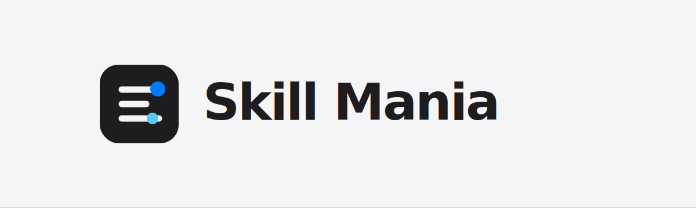

<p align="center">
  
</p>

# Skill Mania

Skill Mania is a portable Agent Skills repository for Codex, Claude Code, and GitHub Copilot. It keeps reusable agent workflows in a tool-neutral `skills/` source tree, then packages the same production skills for plugin and marketplace use.

## Included Skills

- `caveman` - terse, factual, low-prose response mode that preserves blockers and verification gaps.
- `agent-context-maintainer` - durable agent context, metadata, manifest, and packaged-copy hygiene.
- `design-engineer` - context-first UI design workflow for DESIGN.md, planning, implementation, and review loops.
- `design-reviewer` - senior UI/design review, pass/fail gates, scorecards, and visual QA critique.
- `ponytail` - minimal YAGNI implementation mode based on Dietrich Gebert's Ponytail skill.
- `security-engineer` - application security, threat modeling, vulnerability triage, and hardening guidance.
- `seo-geo` - technical SEO, content discoverability, structured data, and generative search visibility guidance.
- `senior-developer` - scoped implementation, debugging, refactoring, review, and maintainability guidance.
- `senior-devops-engineer` - senior platform, DevOps, SRE, cloud infrastructure, delivery, operations, and production-readiness guidance.
- `skill-curator` - discovery, comparison, and trust review for external skills and plugins.
- `software-architect` - system design, service boundaries, tradeoff analysis, and migration planning.
- `testing-engineer` - test strategy, regression coverage, Playwright/UI tests, and flaky-test triage.
- `writing-assistant` - drafting, revision, editorial review, fiction craft, manuscript critique, publishing copy, and Kindle/KDP readiness.

Bundled Codex system skills are intentionally excluded. This repository only stores user-maintained portable skills.

## Docs And Templates

- `docs/litellm.md` - non-secret LiteLLM gateway setup, Codex provider placement, verification, and security review notes.
- `docs/openrouter.md` - direct OpenRouter setup, smoke tests, and review checklist.
- `docs/evaluation.md` - trigger testing, with-skill/baseline comparison, assertions, token/time capture, and release evidence.
- `templates/company.md` - copy to a repository root as `company.md` when skills should respect durable company, product, infrastructure, security, design, SEO, or content guidance.
- `templates/hip0-mania/` - private persona-review profile template. It is intentionally not shipped as a production skill because unfilled personal profiles are confusing in marketplace packages.

## Repository Layout

```text
.
├── assets/                         # Repository media used by documentation
├── docs/                           # Non-skill setup and operations notes
├── templates/                      # Optional templates such as company.md
├── skills/                         # Canonical skill source
│   └── <skill-name>/SKILL.md
├── plugins/skill-mania/            # Packaged plugin copy
│   ├── .codex-plugin/plugin.json   # Codex plugin manifest
│   ├── .claude-plugin/plugin.json  # Claude Code plugin manifest
│   └── skills/                     # Synced copy of canonical skills
├── .claude-plugin/marketplace.json # Claude Code marketplace catalog
├── .agents/plugins/marketplace.json# Codex local marketplace catalog
├── scripts/install-local.sh        # Install skills locally as symlinks or copies
├── scripts/report-skill-budgets.py # Report and enforce context budgets
├── scripts/sync-plugin-package.sh  # Refresh packaged plugin skills
└── scripts/validate-skills.py      # Dependency-free repository validation
```

## Local Installation

Install shared Codex/GitHub Copilot skills and Claude Code skills as symlinks:

```bash
./scripts/install-local.sh --all --link
```

The shared Agent Skills install goes to `~/.agents/skills` by default, which current Codex and GitHub Copilot installations can both discover. `--agents` is the preferred explicit target; `--codex` remains an alias. For older Codex builds that still use `~/.codex/skills`, set the target explicitly:

```bash
CODEX_SKILLS_DIR="$HOME/.codex/skills" ./scripts/install-local.sh --codex --link
```

Use `AGENT_SKILLS_DIR=/path/to/skills` to override the shared target. GitHub Copilot users can also discover or install Agent Skills with `gh skill`.

Claude Code skills install to `~/.claude/skills` by default. Override the target with `CLAUDE_SKILLS_DIR=/path/to/skills`.

Use `--copy` instead of `--link` when you need an independent snapshot rather than a live link to this repository.

## Optional RTK Tooling

RTK is optional. When it is installed, use explicit wrappers for noisy, non-destructive commands such as `rtk git status`, `rtk test <cmd>`, and `rtk err <cmd>`.

Install the global token-saving hook with:

```bash
rtk init -g --auto-patch
```

Verify hook status with:

```bash
rtk init --show
```

Treat RTK output as triage. Rerun the raw command or inspect the RTK tee full-output log before making release, security, review, or debugging decisions that depend on exact output.

## Plugin Usage

Test the Claude Code plugin package locally:

```bash
claude --plugin-dir plugins/skill-mania
```

Add the Claude Code marketplace from the parent directory:

```text
/plugin marketplace add ./skill-mania
/plugin install skill-mania@skill-mania
```

Add the Codex marketplace from the parent directory:

```bash
codex plugin marketplace add ./skill-mania
codex plugin add skill-mania@skill-mania-local
```

When running marketplace-add commands from inside this repository, use `.` instead of `./skill-mania`.

## Authoring Standards

- Keep each skill focused on one coherent workflow or domain role.
- Keep `skills/` limited to production-ready portable skills. Put personal profiles, local setup guides, and non-role documentation in `templates/` or `docs/`.
- Use `templates/company.md` when a team needs durable company, product, infrastructure, security, design, SEO, content, or agent-preference guidance that role skills should respect during repository work. Copy it to the target repository root as `company.md`; do not leave secrets or credentials in it.
- Keep shared `SKILL.md` frontmatter portable. `name` and `description` are required; standard `license`, `compatibility`, and string `metadata` fields are supported when they add real value.
- Ensure the skill `name` matches its directory and uses lowercase letters, digits, and hyphens.
- Put trigger wording in `description`; keep it specific and front-loaded.
- Keep `SKILL.md` concise. Move detailed provider, framework, or domain material into `references/`.
- Link every reference file from `SKILL.md` with clear guidance on when to load it.
- Put routing boundaries in the frontmatter description. Do not spend runtime context on a shared routing reference.
- Use the exact shared `## Honest Opinion` block in every production skill. Apply it to reviews, recommendations, plans, tradeoffs, and implementation close-outs where it adds decision value; keep it outside requested artifacts and routine factual answers.
- Put deterministic or repetitive execution in `scripts/`.
- Put reusable templates, artifacts, examples, static files, and repo media in `assets/`.
- Put Codex UI metadata in `agents/openai.yaml`.
- Avoid secrets, credentials, destructive defaults, hidden network behavior, and machine-specific absolute paths.

## Validation

Run validation before committing:

```bash
./scripts/sync-plugin-package.sh --check
python3 scripts/validate-skills.py skills plugins/skill-mania/skills
```

Run the complete local release gate before publishing:

```bash
./scripts/check-release-ready.sh
```

The validator checks the repository's portable skill contract: standard frontmatter, naming, `SKILL.md` length, relative links, reference routing, current `agents/openai.yaml` sections, assertion-bearing eval manifests, the shared honest-opinion block, plugin manifests, marketplace metadata, and README skill-list drift. The release gate also checks context budgets, synchronized versions, package sync, unit tests, shell syntax, placeholder text, helper smoke tests, and local installer copy mode.

Use `python3 scripts/report-skill-budgets.py` to inspect startup metadata and per-skill context estimates. These are static estimates; actual token and duration decisions should come from with-skill/baseline runs described in `docs/evaluation.md`.

After changing top-level `skills/`, refresh the packaged plugin copy:

```bash
./scripts/sync-plugin-package.sh
```

Before publishing a plugin release:

- Keep fillable personal-profile skills out of shipped `skills/` and starter prompts unless they are intentionally filled and production-ready.
- Run `./scripts/check-release-ready.sh`.
- Bump both Codex and Claude plugin manifest versions together.
- Run material behavior changes through the evaluation workflow and record the benchmark result in the pull request or release notes.
- Create a matching `v<version>` tag; the release workflow verifies the tag and publishes generated release notes.

## References

- Agent Skills specification: https://agentskills.io/specification
- Agent Skills best practices: https://agentskills.io/skill-creation/best-practices
- Codex skills docs: https://developers.openai.com/codex/skills
- Codex plugin build docs: https://developers.openai.com/codex/plugins/build
- OpenAI plugins examples: https://github.com/openai/plugins
- Claude Code skills docs: https://code.claude.com/docs/en/skills
- Claude Code plugin marketplace docs: https://code.claude.com/docs/en/plugin-marketplaces
- GitHub Copilot Agent Skills docs: https://docs.github.com/en/copilot/concepts/agents/about-agent-skills
